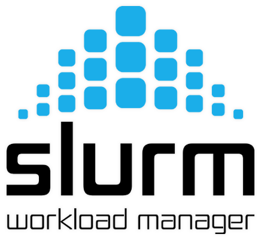

<div align="center">
<h1>SKF-I</h1>
<h2>Server Kimia Fisik Interface</h2>
<p>SKF-Interface an Interface to Submit Computatational Chemistry Job.<br>
<a href="https://orcaforum.kofo.mpg.de/">ORCA v5.0.4</a> | <a href="https://gaussian.com/">Gaussian 09</a> 
</p>
</div>

## Pre-requisites

## Tech used for this project

<div align="center">
<p>
  <a href="https://www.python.org/">
    <h3>Python</h3>
  </a>
</p>
<h2>・</h2>

<p>
  <a href="https://www.schedmd.com/">
    <h3>Slurm Workload Manager</h3>
  </a>
</p>
<h2>・</h2>

<p>
  <a href="/">
    
  </a>
  <a href="/">
    
  </a>
  <a href="/">
    
  </a> <h3>HTML・CSS・JavaScript</h3>
</p>
<h2>・</h2>

</div>

## How to use

Clone the repository

```console
git clone https://github.com/MrFlinxy/SKF-Interface.git
```

Creating .env file

```console
cd SKF-Interface; touch .env
```

put the following into the .env file

```
cat > .env <<EOF
# FIREBASE Configuration
firebase_apiKey = "<apiKey>"
firebase_authDomain = "<authDomain>"
firebase_projectId = "<projectId>"
firebase_storageBucket = "<storageBucker>"
firebase_messagingSenderId = "<messagingSenderId>"
firebase_appId = "<appId>"
firebase_measurementId = "<measurementId>"
firebase_databaseURL ="<databaseURL>"

# FLASK Configuration
secretKey = '<secretKey>'

# Software paths
orca_fullPath = '<orca_fullPath>'
orca_cpus_per_job= '<orca_cpu>'
gaussian_fullPath = '<gaussian_fullPath>'
gaussian_cpus_per_job= '<gaussian_cpu>'
GAUSS_EXEDIR='<GAUSS_EXEDIR>'
GAUSS_SCRDIR='<GAUSS_SCRDIR>'
EOF
```
